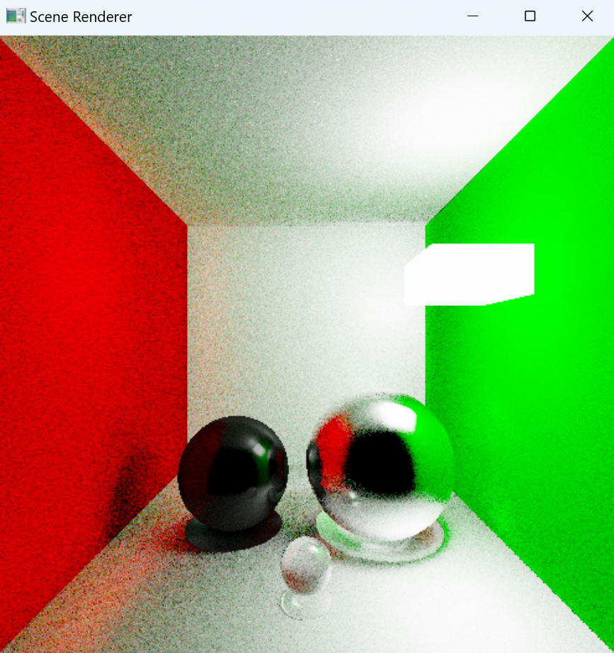

# Зачетное задание по дисциплине "Визуализация трехмерных данных"

Задание:  
> Смоделировать выданные объекты и их физические свойства, расположить объекты в сцене, а также реализовать движущийся источник света, имеющий функцию остановки по нажатию любой клавиши (у меня - пробел). Помимо этого, рендеринг сцены должен осуществляться с использованием трассировки лучей.

## Быстрый старт

```cmd
python -m venv scene_renderer
```

```cmd
.\scene_renderer\Scripts\activate
```

```cmd
git clone https://github.com/mariaa-ea/Python-OpenGL-Scene-Renderer.git
```

```cmd
cd Python-OpenGL-Scene-Renderer
```

```cmd
pip install -r requirements.txt
```

```cmd
python SceneRenderer.py
```

## Результат 



За основу взят код из [этого](https://github.com/MomoDeve/PathTracer/tree/master) репозитория.   

**Работа выполнена: _Марией Емельяновой_**
